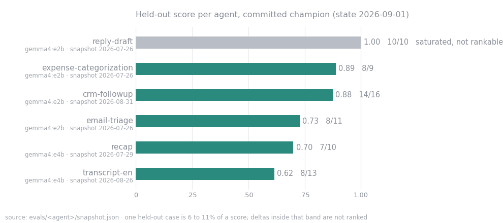

# agent-exam-suite


> **Public snapshot (repo state 2026-09-08, published 2026-09-08).** A curated,
> sanitized cut of a private working repo: the agents, the exams, the runner and the write-up
> are the real working tree. Kept private on purpose: the per-lane build ledger, the
> build-harness submodule, the sprint queue, lane briefs and resume kits, competitor notes,
> per-probe result archives, a task corpus mined from private production repos, and anything
> naming a client (a sales lead is referred to as "the lead"). Some links in the write-up
> therefore point at files that are not in this snapshot.

Local-first agent sandbox. Seven small office agents (email triage, CRM follow-up, expense
categorization, meeting recap, reply drafting, call-transcript summarisation, request intake) run on local
models (2B to 14B on a 16 GB laptop; sizes are Gemma's effective sizes, Ollama lists
`gemma4:e2b-it-qat` as 2.3B effective, 5.1B with embeddings) or on hosted models through one config line. The agents
are deliberately boring. The exam suite around them is the point of this repo.

**The case for that claim, with receipts:**
[`docs/eval-suite-is-the-asset.md`](docs/eval-suite-is-the-asset.md) ·
[visual walkthrough](https://michiel-dk.github.io/agent-exam-suite/eval-suite-is-the-asset.html)



## The thesis

Agents are disposable, eval suites are the asset. An agent here is a prompt, a tool list and
one model line; it can be rewritten in an afternoon. What compounds is the committed exam
behind it: train/held-out splits, deterministic scoring with no LLM judge anywhere, a
regression gate that exits 1 on drift, and a routing layer that refuses to pick a model when
two sit inside the noise band. Swap the agents, keep the discipline.

## The story, in beats

The section headings of the write-up, one or two sentences each. Every number traces to a
committed file named in the write-up.

1. **The scoreboard, failures included.** A 1.00 is reported as a defect of the exam, not a
   win for the model. reply-draft sits at 1.00 and is labelled useless for ranking.
2. **A 72-minute sweep whose headline indicted its own instrument.** Six challenger models
   against four exams, noise band computed before ranking. The headline was "2 of 4 exams no
   longer discriminate", published instead of the leaderboard.
3. **Model size is not the lever.** A 4B, an 8B and a 14B all score 7/10 held-out on recap;
   the 8B drops items, the 14B blows the length bar. Same trade-off curve, different points.
4. **An experiment killed by its own pre-registered falsifier.** The first multi-turn exam
   died before a line was built: 9 model calls showed the champion held all constraints 3/3
   across turns, and the kill criterion was written down in advance.
5. **Failure signatures, not vibes.** Every model note names how it was observed. Newer
   named modes: termination death, protocol break under large payloads, decoy extraction,
   silent scope-drop.
6. **What is honestly broken.** Held-out sets are 9 to 18 cases, so one case is 6 to 11% of
   a score; the suite ranks bad models out but cannot separate two good ones. All case inputs
   are synthetic. Nothing fires the gate mechanically yet (no CI, no hook).
7. **Why this transfers.** None of it is specific to these seven agents. Check seen red before
   trusted green, pre-register kill criteria, compute noise bands before rankings, fail loud.

## Scoreboard

Held-out score of the committed champion per agent. Source: `evals/<agent>/snapshot.json`
(`heldout_score`, `model`, `date`), read from the 2026-09-08 repo state. Held-out counts
from `evals/<agent>/cases.json`. Generated by the snapshot script, not typed; the chart above comes from `scripts/scoreboard.py`.

| agent | exam mode | champion | held-out | snapshot date | note |
|---|---|---|---|---|---|
| reply-draft | properties | gemma4:e2b-it-qat | 1.000 (10/10) | 2026-09-07 | saturated, useless for ranking |
| task-intake | labels | gemma4:e2b-it-qat | 0.950 (19/20) | 2026-09-07 | seventh agent: routes a typed request to the right specialist, or refuses |
| email-triage | labels | gemma4:e2b-it-qat | 0.909 (10/11) | 2026-09-07 |  |
| expense-categorization | fields | gemma4:e2b-it-qat | 0.889 (8/9) | 2026-09-07 |  |
| crm-followup | trajectory | gemma4-e2b-ctx16k | 0.833 (15/18) | 2026-09-07 | production-size payloads; 4 multi-turn cases; champion swapped 4B to 2B (PR #60) |
| recap | properties | gemma4:e4b-it-qat | 0.700 (7/10) | 2026-09-07 | the hardest exam, on purpose |
| transcript-en | properties | gemma4-e4b-ctx16k | 0.526 (10/19) | 2026-09-08 | English call transcripts incl. a 10-case long-call band (12k-33k chars); local 4B ties Kimi-K3 2/6 on it |

Hosted models run the same exams through the same entry point. On the production-payload
crm-followup exam the hosted flagships land below the local 2B champion (GLM-5.3 10/16,
Kimi K3 7/16, champion 14/16 on the 28-case exam of 2026-08-31). Day-to-day provider variance
on hosted rows can exceed the within-day error bar, so hosted scores are only compared
same-day. Per-probe result files stay in the working repo; the write-up carries the numbers.

## Layout

```
agents/     one folder per agent: prompt.md + agent.yaml (+ tools.py for tool agents)
evals/      per-agent exams: cases.json + properties.py + tools_mock.py + snapshot.json; cross-exam test_*.py
sandbox/    runner.py · router.py · policy.py · retry.py · watcher.py · serve.py · test_*.py
frontend/   index.html (zero-dependency scoreboard)
docs/       eval-suite-is-the-asset.md (+ .html walkthrough) · model-notes.md · concept.md ·
            deepdive.md · the probe write-ups the write-up cites
```

## Commands

```
pip install -r requirements.txt                     # requests, PyYAML; Ollama for local models

python3 sandbox/runner.py list                      # agents + exam modes
python3 sandbox/runner.py run <agent> [--snapshot]  # run exam, optionally set champion
python3 sandbox/runner.py check <agent>             # regression gate (exit 1 on drift)
python3 sandbox/runner.py diff <agent> --models m1,m2   # same exam, N models, one table
python3 sandbox/runner.py run-all [--snapshot]      # every agent's exam in one go
python3 sandbox/runner.py check-all                 # regression gate over all snapshots
python3 sandbox/runner.py live <agent> --input "..."    # real input, real tools (not the exam)
python3 sandbox/runner.py promote <agent> --expected ...   # turn a live trace into a committed case
python3 sandbox/runner.py route [--agent a]         # which tier to START on, per task; refuses inside the noise band
python3 sandbox/runner.py taxonomy                  # failure-mode taxonomy over results/

python3 sandbox/watcher.py [--baseline]             # new model detected: exam everything
python3 sandbox/serve.py                            # scoreboard at localhost:8765
```

`run`, `check` and `diff` take `--provider` (ollama | scaleway | ovh | nebius | openrouter | stub),
`--timeout` and `--dedupe-tools`. Per-agent knobs in `agent.yaml`, all off by default: `json_mode`,
`reasoning_effort`, `provider_routing`. Hosted providers need their key in the environment
(`OPENROUTER_API_KEY` etc.); nothing is read from a file.

Exam extras (per-exam config in cases.json): `"samples": k` + `"sample_temperature"` for pass@k
(a case passes only if every sample passes); `"turns"` on a case for multi-turn scoring (per-turn
verdicts over full-history context, one scoring path); `evals/<agent>/rubric.md` + `"judge"` for an
LLM-as-judge lane that stays wired but that no shipped exam uses (reply-draft dropped its judge
2026-07-24 after the judge mis-passed 3/3 invented-date replies).

## Exam modes, the complexity ladder

| mode | scores | example agent |
|------|--------|---------------|
| labels | exact match on expected fields | email-triage |
| fields | per-field partial credit | expense-categorization |
| properties | properties.py checks, no golden answers | reply-draft, recap, transcript-en |
| trajectory | tools called, step budget, grounded answer; multi-turn cases score per turn | crm-followup |

Exams score train and held-out separately; only held-out is real (never tune on it). Tool agents:
exams use `evals/<agent>/tools_mock.py` (deterministic), `live` uses the real `agents/<agent>/tools.py`
with the same signatures, so wiring a real CRM changes nothing about the exam.

## Status

**Status (2026-09-08):** 7 agents, 184 committed cases (87 train / 97
held-out), 35 test files; the suite is judge-free and deterministic. Limitation, stated
plainly: held-out sets are small enough that the suite ranks bad models out but cannot separate two
good ones, and every case input is hand-authored. Growing measurement power and getting real inputs
in are the active work. The per-lane build ledger (post-mortems included) stays in the working repo.
