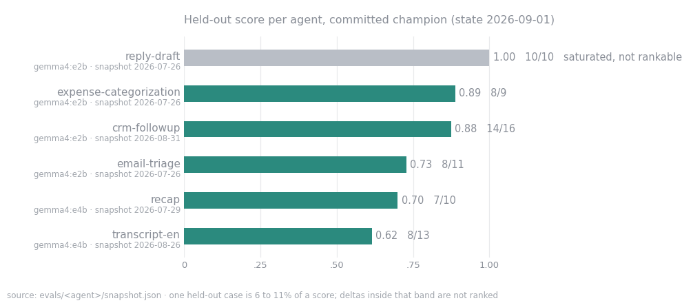

# agent-exam-suite


> **Public snapshot (repo state 2026-10-06, published 2026-10-06).** A curated,
> sanitized cut of a private working repo: the agents, the exams, the runner and the write-up
> are the real working tree. Kept private on purpose: the per-lane build ledger, the
> build-harness submodule, the sprint queue, lane briefs and resume kits, competitor notes,
> per-probe result archives, a task corpus mined from private production repos, and anything
> naming a client (a sales lead is referred to as "the lead"). Some links in the write-up
> therefore point at files that are not in this snapshot.

Local-first agent sandbox. Eight small office agents (email triage, CRM follow-up, expense
categorization, meeting recap, reply drafting, call-transcript summarisation, CRM fields from a call, request intake) run on local
models (2B to 14B on a 16 GB laptop; sizes are Gemma's effective sizes, Ollama lists
`gemma4:e2b-it-qat` as 2.3B effective, 5.1B with embeddings) or on hosted models through one config line. The agents
are deliberately boring. The exam suite around them is the point of this repo.

**Three findings, one chart, one command (October 2026):**
[**results page**](https://michiel-dk.github.io/agent-exam-suite/results-2026-10.html) · source [`docs/results-2026-10.html`](docs/results-2026-10.html), built by `scripts/build_results_page.py` from committed files only.

1. **A 2B–4B model on a laptop holds every short decision task and loses only long summaries.** Level with the hosted
   flagships on email triage, expense fields, reply drafts, the CRM brief over tool calls (where the 2B is the best model
   of any size) and the digest; one case behind on CRM field write-back, four behind on long call summaries. Local ≈ $0,
   open weights hosted $0.23–$5.41, the vendor flagship $5–$127 per 10k tasks (metered, 27 Sep matrix, 2 Oct ledger).
2. **Temperature zero is not determinism on hosted APIs; a gate that re-sits every case catches what moved.** GLM-5.3:
   10/13 call summaries on one run, 6/13 across six same-day runs (pass^6). The local champions pass every case on all
   three loads. A runtime upgrade on 2 Oct moved 1 of 220 cases, none held-out (`docs/probes/l0-resnapshot-2026-10-02`).
3. **Four fine-tunes of the local champion, four refusals, the cause named** — an unmasked loss that was 95% tool payload,
   then a per-step cut that taught a "call again" reflex. Each killed by its pre-registered rule (`docs/probes/i2v*`).

Reproduce finding 2 from the committed files: `python3 docs/probes/pass3-column-2026-09-28/pass_k.py`.

**The longer case, with receipts (August):**
[`docs/eval-suite-is-the-asset.md`](docs/eval-suite-is-the-asset.md) ·
[visual walkthrough](https://michiel-dk.github.io/agent-exam-suite/eval-suite-is-the-asset.html)



## Where to look (five folders)

| folder | what is in it |
|---|---|
| [`docs/results-2026-10.html`](https://michiel-dk.github.io/agent-exam-suite/results-2026-10.html) | the page: three findings, the chart, the reproduce command |
| [`docs/post-mortems/`](docs/post-mortems/) | three times the instrument was wrong — belief, probe, fix |
| [`evals/`](evals/) | one exam per agent: `cases.json` (train / held-out), deterministic checks, the committed 3-load snapshot |
| [`docs/probes/`](docs/probes/) | the experiments behind every number; each `RESULTS.md` opens with the one cell that carries the verdict |
| [`sandbox/`](sandbox/) | `runner.py` (run · check · diff · snapshot · route), the provider router, the tests |

Agents are deliberately boring: a prompt, a tool list, one model line (`agents/<name>/`). The exam behind each one is the
point. Longer argument, with receipts: [`docs/eval-suite-is-the-asset.md`](docs/eval-suite-is-the-asset.md).

## Scoreboard

Held-out score of the committed champion per agent, from `evals/<agent>/snapshot.json` at the 2026-10-06 repo state;
generated by the snapshot script, never typed.

| agent | exam mode | champion | held-out | snapshot date | note |
|---|---|---|---|---|---|
| reply-draft | properties | gemma4:e2b-it-qat | 1.000 (10/10) | 2026-10-02 | saturated, useless for ranking |
| task-intake | labels | gemma4:e2b-it-qat | 0.955 (21/22) | 2026-10-02 | seventh agent: routes a typed request to the right specialist, or refuses |
| email-triage | labels | gemma4:e2b-it-qat | 0.909 (10/11) | 2026-10-02 |  |
| expense-categorization | fields | gemma4:e2b-it-qat | 0.889 (8/9) | 2026-10-02 |  |
| crm-followup | trajectory | gemma4-e2b-ctx16k | 0.833 (15/18) | 2026-10-02 | production-size payloads; 4 multi-turn cases; champion swapped 4B to 2B (PR #60) |
| call-fields | fields | gemma4-e4b-ctx16k | 0.737 (14/19) | 2026-10-02 |  |
| recap | properties | gemma4:e4b-it-qat | 0.700 (7/10) | 2026-10-02 | the hardest exam, on purpose |
| transcript-en | properties | gemma4-e4b-ctx16k | 0.526 (10/19) | 2026-10-02 | English call transcripts incl. a 10-case long-call band (12k-33k chars); local 4B ties Kimi-K3 2/6 on it |

## Commands

```
pip install -r requirements.txt                       # requests, PyYAML; Ollama for local models
python3 docs/probes/pass3-column-2026-09-28/pass_k.py # finding 2 from committed files, no model needed
./.cline/test.sh                                      # the test gate: one process per file, exit code captured
python3 sandbox/runner.py list                        # agents, champions, exam modes
python3 sandbox/runner.py check <agent>               # re-sit one exam vs its snapshot, per case (needs Ollama + the champion)
python3 sandbox/runner.py diff <agent> --models m1,m2 # same exam, several models, one table
python3 sandbox/runner.py run <agent> --provider openrouter --model <id>   # a hosted model through the same entry point
```

`pytest` runs in CI but is blind to this repo's `check()`-style test files (post-mortem 3); the gate is `./.cline/test.sh`.
Hosted providers need their key in the environment; nothing is read from a file.

## Status


**Status (2026-10-06):** 8 agents, 220 committed cases (102 train / 118
held-out), 39 test files; the suite is judge-free and deterministic. Every snapshot is three fresh
loads at temperature 0 with a runtime stamp, so a runtime bump or a model swap re-sits the exam per case. Limitation, stated
plainly: held-out sets are 9–22 cases, so the suite ranks bad models out but cannot separate two good ones (the results
table prints how many candidates competed and calls a one-case gap noise), and every case input is hand-authored.
Getting real inputs in is the active work. The per-lane build ledger (post-mortems included) stays in the working repo.
